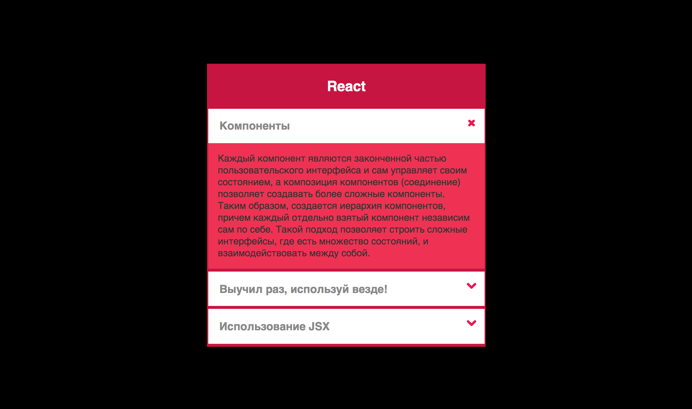

Аккордеон
===

Вам необходимо реализовать максимально универсальный компонент аккордеон и построить с его использованием интерфейс как на картинке:

## Интерфейс

Весь аккордеон обернут тегом `<main>`. Каждый блок аккордеона обернут в тег `<section>`. Когда блок имеет класс `open`, он раскрыт. Иначе видно только заголовок блока.

## Функционал

Заголовок аккордеона, количество блоков, заголовок каждого блока и текст — должны быть настраиваемыми. По клику на заголовок блока он должен раскрываться/схлопываться.

## Реализация

Реализовать компонент `Accordion` и построить демо с его использованием.

### Локально с использованием git

Изменения необходимо внести в файлы `./index.html` и `./js/index.js`. Вносить изменения в CSS не требуется.

### В песочнице CodePen

Реализуйте компонент во вкладках «HTML» и «JS». Перед началом работы сделайте форк этого пена:

https://codepen.io/Netology/pen/qovQeg
