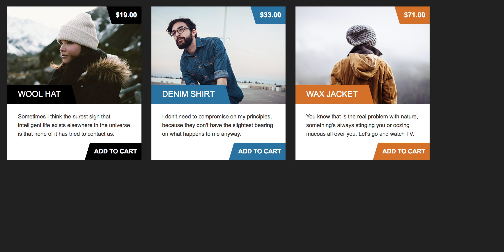

Список товаров
===

Усовершенствуйте реализацию списка товаров используя композицию.

## Описание задачи

Компонент `Item` позволяет вывести карточку товара. Он принимает следующие атрибуты:
- `color` — название цвета для оформления элементов карточки,
- `item` — объект товара, который необходимо отобразить.

Сейчас вся логика выбора цвета от типа товара зашита в компонент `App`, что делает его более сложным — он решает задачи, за которые по логике отвечать не должен.

С другой стороны, мы не можем изменить компонент `Item`, потому что в некоторых частях нашего приложения используется различная логика выбора цвета карточки.

Ваша задача — найти решение при котором компонент `Item` останется неизменным, а компонент `App` не будет отвечать за выбор цвета карточки товара.

## Реализация

Переработайте компонент `App` и создайте новые компоненты, если потребуется.

### Локально с использованием git

Изменения необходимо внести в файл `./js/App.js`. Все файлы уже подключены к документу, другие файлы изменять не требуется.

### В песочнице CodePen

Реализуйте компонент во вкладке «JS». Перед началом работы сделайте форк этого пена:

https://codepen.io/Netology/pen/JLzwox
