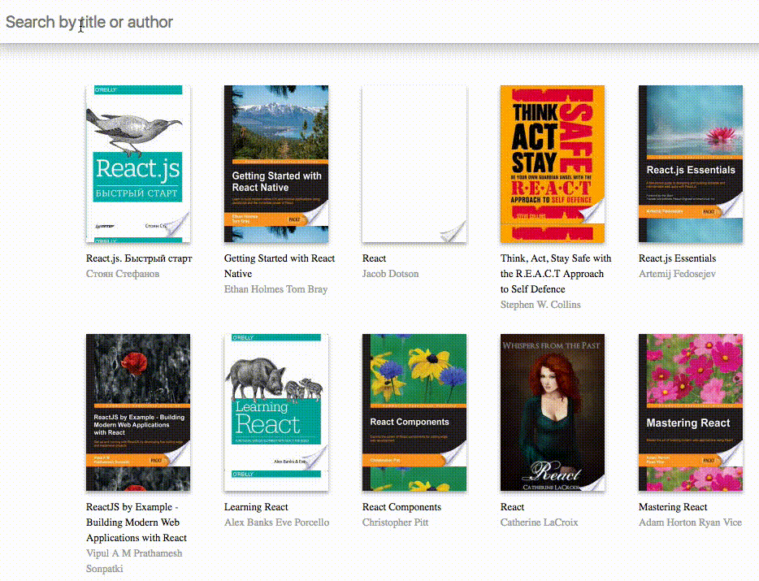

Библиотека
===

Ваша задача — реализовать компонент для отображения и фильтра книжек в вашей библиотеке.

## Описание проекта

В проекте находится файл `App.js`, который содержит компонент класса `App`.
`App` управляет состоянием приложения и хранит список загруженных книг (свойство `state.books`),
 а также содержит функционал загрузки нового списка по заданному запросу (метод `filterBooks`).

Пользователю показываются все книги, доступные в приложении по текущему запросу (по умолчанию `react`).

## Реализация

От предыдущего разработчика вам достался частично реализованный проект. 

В нем необходимо реализовать компонент `SearchBox` так, чтобы при изменении текста в компоненте выполнялся поиск по введенной строке запроса, а также чтобы при поиске по автору по клику на его имени SearchBox отображал имя автора.
Компонент в данный момент представляет собой заглушку без какого-либо функционала. 
Этот компонент имеет два свойства: 
- `value` — строка, в которой содержится текущее значение строки поиска, 
- `filterBooks(newValue)` — метод со строковым параметром, при вызове которого выполняется новый поиск книг.
В качестве параметра он получает новую строку запроса для поиска. 

### Локально с использованием git

Компонент необходимо реализовать в файле `./js/SearchBox.js`.
**Вы можете изменять файл `SearchBox.js` как угодно**

### В песочнице CodePen

Реализуйте компонент во вкладке JS(Babel). Перед началом работы сделайте форк этого пена:

https://codepen.io/Netology/pen/yKwGNp
