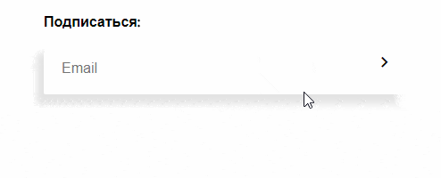

Форма подписки
===

Ваша задача — реализовать форму для подписки на новости.



## Описание компонента

Необходимо реализовать форму подписки на новости с встроенной валидацией.

* При вводе невалидного email-адреса форма получает класс `is-error`, и пользователю показывается сообщение с текстом 
`Пожалуйста, проверьте корректность адреса электронной почты`.
* При вводе корректного email-адреса форма получает класс `is-valid`.
* Для проверки корректности введенного адреса используется браузерный механизм валидации, доступный в HTML5 для поля ввода с типом "email".
Текущее состояние валидации можно получить из input-элемента `element.validity.valid`. 
Дополнительных функций проверки соответствия введенной строки формату адреса электронной почты 
с помощью регулярных выражений или любым другим способом писать не нужно.

HTML-структура формы:

```html
<div class="subscribe__form">
  <form class="form form--subscribe">
    <h4 class="form-title">Подписаться:</h4>
    <div class="form-group">
      <label for="input-email" class="sr-only">Email</label>
      <input type="email" id="input-email" placeholder="Email" class="form-control"/>
      <div class="form-error">Пожалуйста, проверьте корректность адреса электронной почты</div>
      <button type="submit" class="form-next">
        <i class="material-icons">keyboard_arrow_right</i>
      </button>
    </div>
  </form>
</div>
```

## Реализация

Необходимо реализовать компонент `SubscribeForm`.

### Локально с использованием git

Компонент необходимо реализовать в файле `./js/SubscribeForm.js`. Файл уже подключен к документу, поэтому другие файлы изменять не требуется.
Файл содержит компонент-заглушку без необходимого функционала.
**Вы можете изменть файл `SubscribeForm.js` каким угодно образом, а также создавать любые дополнительные компоненты.**

### В песочнице CodePen

Реализуйте компонент во вкладке JS(Babel). Перед началом работы сделайте форк этого пена:

https://codepen.io/Netology/pen/XEGomP