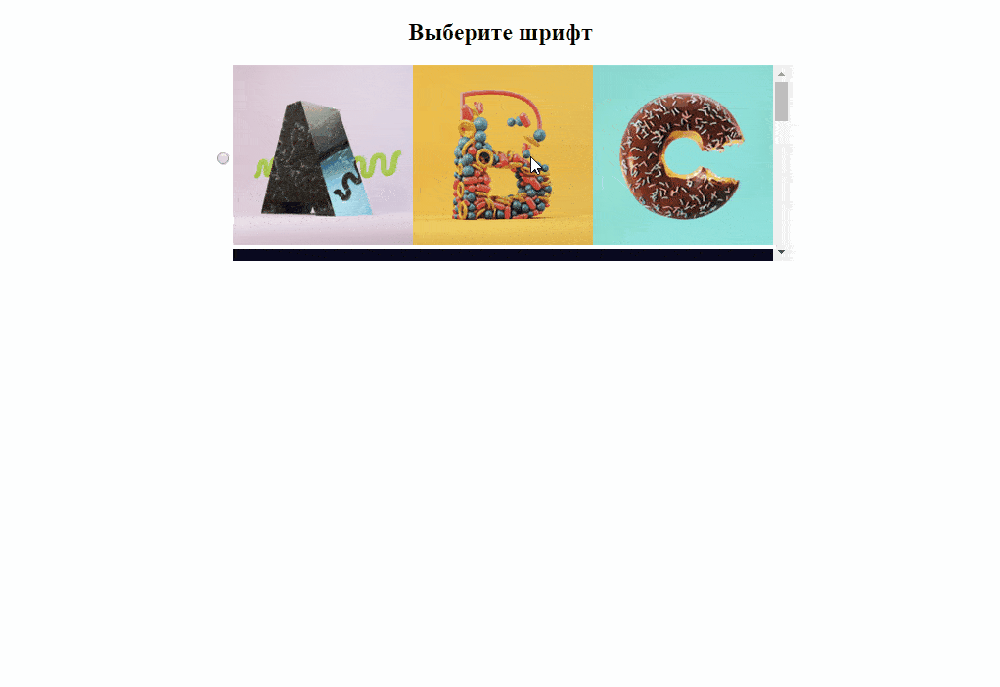
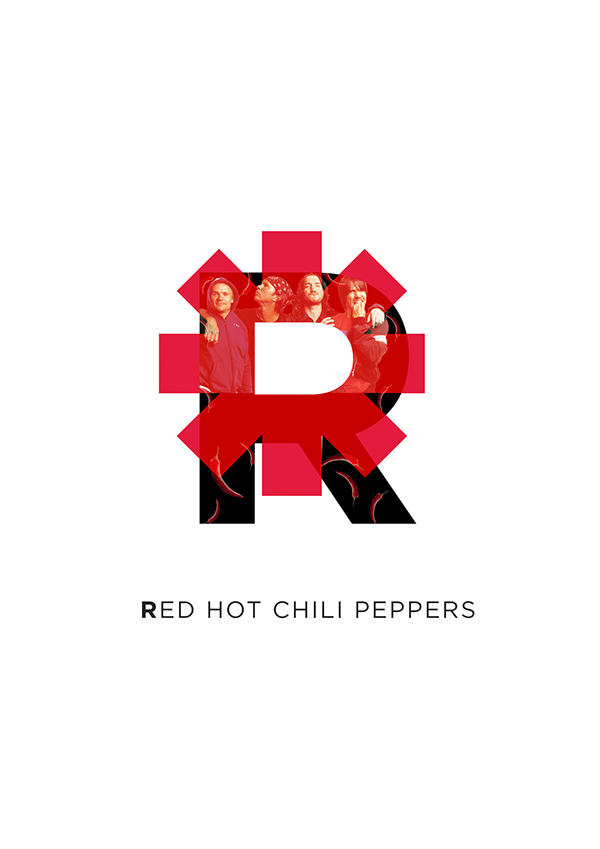
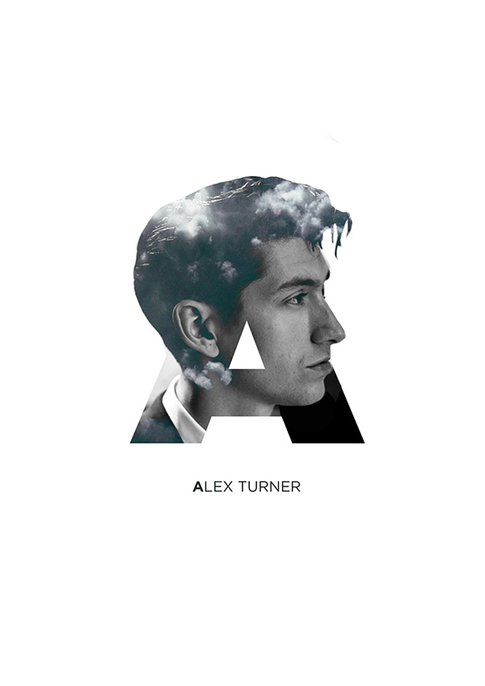
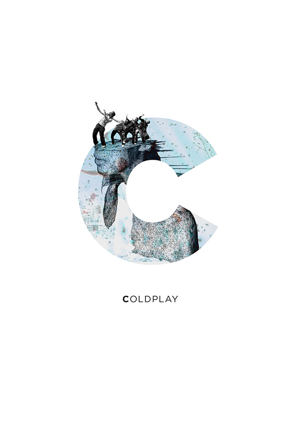
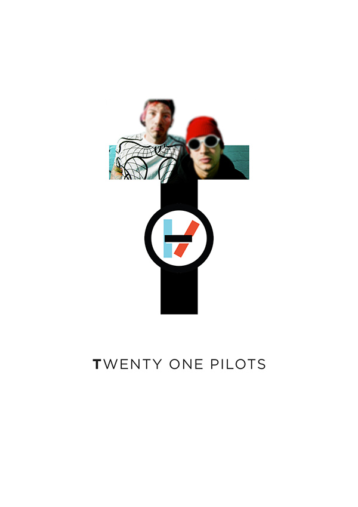

Конструктор футболки
===

Ваша задача — реализовать компонент-конструктор для создания надписи с использованием шрифта из изображений.
Пользователь может выбрать шрифт из списка предложенных, затем написать текст (только латинские буквы) и увидеть его в виде изображений.



## Описание компонента

В проекте находится файл `App.js`, который содержит компонент класса `App`. 
`App` управляет состоянием приложения и содержит в свойстве `state` следующие свойства:
- массив `fonts`, в котором хранятся все доступные шрифты в виде объектов
- объект `selectedFont`, в котором находится объект текущего выбранного шрифта (из массива `fonts`), или null, если шрифт еще не выбран
- строка `text` — введенный пользователем текст, который должен отобразиться выбранным «картиночным» шрифтом.  

Объект шрифта (из массива `fonts` и свойства `selectedFont` состояния приложения) содержит два свойства:

- строка `name` — название шрифта;
- строка `path` — путь до папки с изображениями; в такой папке каждой букве латинского алфавита соответствует одноимённое изображение с расширением `jpg`.

Пример содержимого массива:
```javascript
[
    {
        name: "abc1",
        path: "./images/abc1/images"
    },
    {
        name: "abc2",
        path: "./images/abc2/images"
    }
]
```

В файле `PictureFont.js` находится компонент `PictureFont`. В качестве параметров `PictureFont` принимает:
- строку `text` — введенный пользователем текст, который нужно отобразить шрифтом-картинками;
- строку `path` — путь к папке, где находятся картинки букв.

`PictureFont` возвращает HTML-представление набранного текста выбранным «картиночным» шрифтом. Пример отображения текста «react»:
```html
<div class="PictureFont grid">
  <div class="char">
    
  </div>
  <div class="char">
    
  </div>
  <div class="char">
    
  </div>
  <div class="char">
    
  </div>
  <div class="char">
    
  </div>
</div>
```

Данное приложение должно иметь следующий функционал: 
- вывод списка всех доступных «картиночных» шрифтов с возможностью выбора одного шрифта. 
 Для этого каждый шрифт выводится в виде блока `div`, содержащего элемент `input` типа `radio` с превью первых трёх букв, пример HTML-кода для каждого шрифта:
  ```html
  <div class="grid center font-item">
    <input type="radio" name="font" value="abc1" id="abc1">
    <label for="abc1" class="grid-1">
      <!-- компонент PictureFont - его необходимо использовать в этом месте -->
      <div class="picture-font grid">
        <div class="char">
          
        </div>
        <div class="char">
          
        </div>
        <div class="char">
          
        </div>
      </div>
      <!-- конец компонента PictureFont -->
    </label>
  </div>
  ```

- после выбора пользователем одного из шрифтов, появляется текстовое поле для ввода текста:
  ```html
  <div class="type-text">
    <textarea name="text" id="font-text" cols="30" rows="2" placeholder="Введите текст для футболки"></textarea>
  </div>
  ```
- при наборе текста в поле текущий текст отображается выбранным «картиночным» шрифтом;
- после того, как текст набран, пользователь может переключаться между шрифтами, при этом в зависимости от выбранного им шрифта меняется и отображение набранного текста.

## Реализация

Для доработки приложения необходимо реализовать два компонента:
1. `FontSelector` — отвечает за вывод всех доступных «картиночных» шрифтов с возможностью выбора пользователем. 
Для вывода примера шрифта используйте компонент PictureFont. Он получает от компонента App три свойства:
 - `fonts` — массив с объектами шрифтов,
 - `onSelect(font)` — метод, принимающий в качестве параметра объект шрифта и выполняющий установку переданного ему шрифта как выбранного,
 - `selected` — объект выбранного в данный момент шрифта.
2. `TextRenderLine` — поле для ввода пользовательского текста, который будет отрисован выбранным «картиночным» шрифтом.
Этот компонент имеет два свойства:
- `value` — текущее значение набранного текста,
- `onChange(newValue)` — метод, принимающий в качестве параметра строку и устанавливающий новое значение набранного текста.


### Локально с использованием git

Оба компонента уже созданы в папке `js` в файлах `FontSelector.js` и `TextRenderLine.js`,
подключены в `index.html` и вызваны в `App` в соответствующих местах.  
**Вы можете изменять эти два файла каким угодно образом**  
**Вы можете создавать любые дополнительные компоненты.**

### В песочнице CodePen

Реализуйте компонент во вкладке JS(Babel). Перед началом работы сделайте форк этого пена:

https://codepen.io/Netology/pen/eMXbJK
