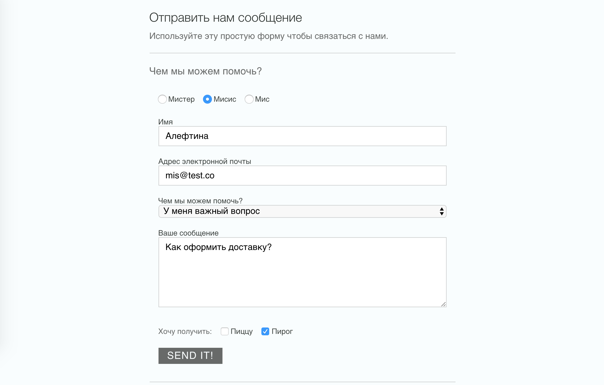

Форма обратной связи
===

Необходимо реализовать форму обратной связи. Форма должна принимать объект с исходными значениями полей, и заполнять поля в соответствии с переданными значениями:


## Значения по умолчанию

Информация об исходных значениях полей формы передаётся в виде объекта со следующими свойствами:
- `salutation` — обращение, _строка_;
- `name` — имя, _объект_;
- `email` — адрес электронной почты, _строка_;
- `subject` — причина обращения, _строка_, варианты значений: `У меня проблема`, `У меня важный вопрос`;
- `message` — текст сообщения, _строка_;
- `snacks` — что хочет получить клиент в качестве бонуса, _массив строк_.

Все свойства не обязательные, и не должно возникать ошибок при их отсутствии.

## Описание компонента

Необходимо создать компонент `FeedbackForm`. Он должен иметь атрибуты:
- `data` — значение полей формы по умолчанию, _объект_;
- `onSubmit` — обработчик события отправки формы, _функция_.

При отправке формы необходимо вызвать обработчик события отправки формы, переданный в атрибуты, и передать в него первым аргументом _строку_ c данными формы в формате JSON.

Верстка формы:
```html
<form class="content__form contact-form">
  <div class="testing">
    <p>Чем мы можем помочь?</p>
  </div>
  <div class="contact-form__input-group">
    <input class="contact-form__input contact-form__input--radio" id="salutation-mr" name="salutation" type="radio" value="Мистер"/>
    <label class="contact-form__label contact-form__label--radio" for="salutation-mr">Мистер</label>
    <input class="contact-form__input contact-form__input--radio" id="salutation-mrs" name="salutation" type="radio" value="Мисис"/>
    <label class="contact-form__label contact-form__label--radio" for="salutation-mrs">Мисис</label>
    <input class="contact-form__input contact-form__input--radio" id="salutation-ms" name="salutation" type="radio" value="Мис"/>
    <label class="contact-form__label contact-form__label--radio" for="salutation-ms">Мис</label>
  </div>
  <div class="contact-form__input-group">
    <label class="contact-form__label" for="name">Имя</label>
    <input class="contact-form__input contact-form__input--text" id="name" name="name" type="text"/>
  </div>
  <div class="contact-form__input-group">
    <label class="contact-form__label" for="email">Адрес электронной почты</label>
    <input class="contact-form__input contact-form__input--email" id="email" name="email" type="email"/>
  </div>
  <div class="contact-form__input-group">
    <label class="contact-form__label" for="subject">Чем мы можем помочь?</label>
    <select class="contact-form__input contact-form__input--select" id="subject" name="subject">
      <option>У меня проблема</option>
      <option>У меня важный вопрос</option>
    </select>
  </div>
  <div class="contact-form__input-group">
    <label class="contact-form__label" for="message">Ваше сообщение</label>
    <textarea class="contact-form__input contact-form__input--textarea" id="message" name="message" rows="6" cols="65"></textarea>
  </div>
  <div class="contact-form__input-group">
    <p class="contact-form__label--checkbox-group">Хочу получить:</p>
    <input class="contact-form__input contact-form__input--checkbox" id="snacks-pizza" name="snacks" type="checkbox" value="пицца"/>
    <label class="contact-form__label contact-form__label--checkbox" for="snacks-pizza">Пиццу</label>
    <input class="contact-form__input contact-form__input--checkbox" id="snacks-cake" name="snacks" type="checkbox" value="пирог"/>
    <label class="contact-form__label contact-form__label--checkbox" for="snacks-cake">Пирог</label>
  </div>
  <button class="contact-form__button" type="submit">Отправить сообщение!</button>
  <output id="result" />
</form>
```

Обратите внимание, что для того чтобы в JSX задать атрибут `for` необходимо использовать атрибут `htmlFor`.

## Пример использования

```jsx
const form = {
  salutation: 'Мисис',
  name: 'Алевтина',
  subject: 'У меня важный вопрос',
  message: 'Как оформить доставку?',
  email: 'mis@test.co',
  snacks: ['пирог']
}

ReactDOM.render(
  <FeedbackForm data={form} />,
  document.getElementById('root')
);
```

## Реализация

Необходимо реализовать компонет `FeedbackForm`.

### Локально с использованием git

Компонент необходимо реализовать в файле `./js/FeedbackForm.js`. Файл уже подключен к документу, поэтому другие файлы изменять не требуется.

### В песочнице CodePen

Реализуйте компонент во вкладке JS(Babel). Перед началом работы сделайте форк этого пена:

https://codepen.io/dfitiskin/pen/vZRXVE
