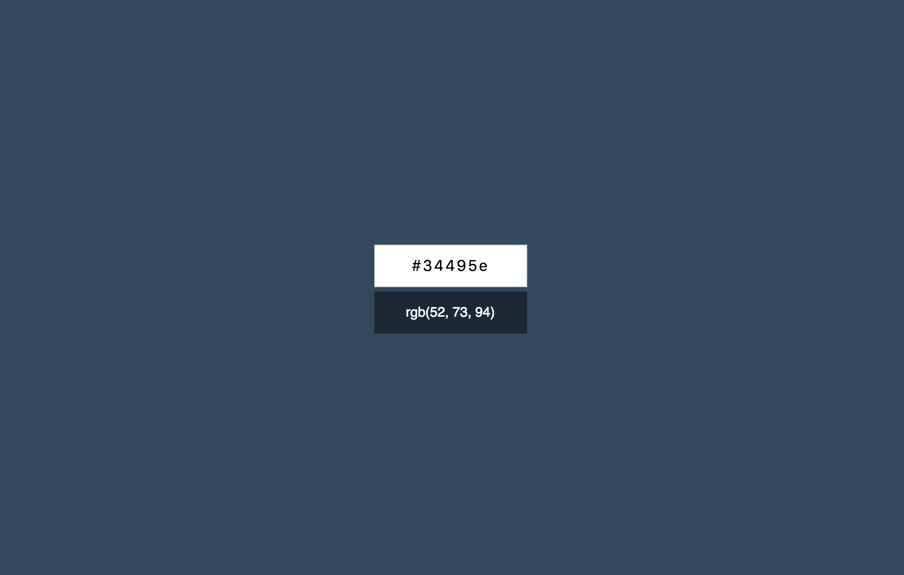
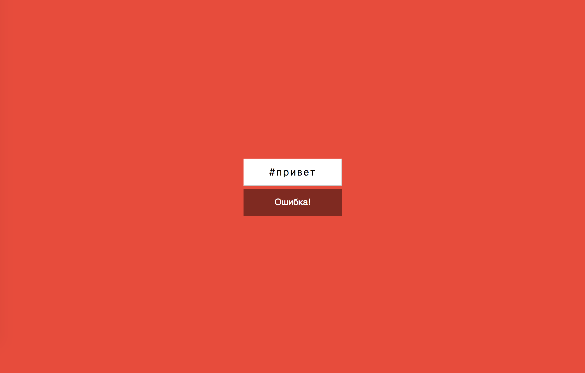
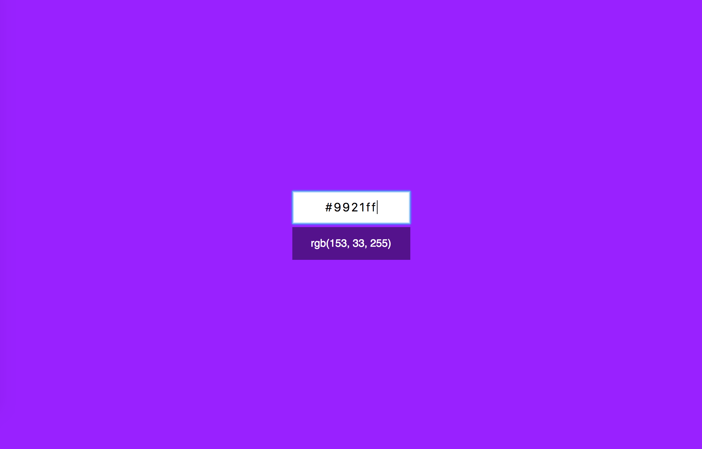

Конвертер цветов из HEX в RGB
===

Наш разработчик переписал конвертер цветов с чистого DOM API на React. Но он теперь не работает. Ваша задача найти и исправить ошибку.



## Интерфейс конвертера

Как понять что вы починили конвертер? Рабочий конвертер должен соответствовать следующим простым требованиям.

Конвертер при вводе неправильного цвета в формате HEX должен сообщать об ошибке:


При правильном вводе цвета он показывает его представление в формате RGB и меняет цвет фона на заданный цвет:


## Локализация ошибки

Наш разработчик уверен что ошибка допущена в компоненте `HexInput`, поэтому просил не трогать остальной код.

В консоль выдаётся следующее сообщение об ошибке:
```
Uncaught TypeError: Cannot read property 'value' of undefined
```

Постарайтесь выяснить причину ошибки и предложить максимально простое решение.

## Реализация

Необходимо исправить ошибку в компонете `HexInput`.

### Локально с использованием git

Компонент реализован в файле `./js/HexInput.js`. Другие файлы изменять не требуется.

### В песочнице CodePen

Исправьте компонент во вкладке JS(Babel). Перед началом работы сделайте форк этого пена:

https://codepen.io/dfitiskin/pen/BZxPEb
