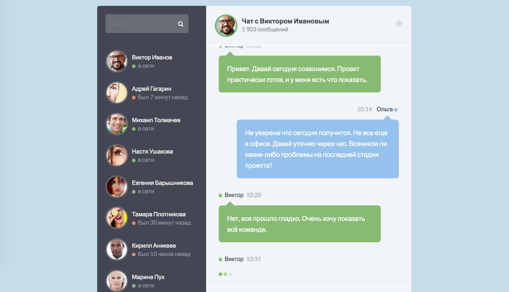

История чата
===

Необходимо реализовать один из компонентов чата — историю сообщений:


## Данные

Список сообщений передаваемый в компонент представляет собой _массив объектов_, каждый из которых представляет собой сообщение, которое необходимо отразить в истории. Сообщение имеет следующие свойства:
- `id` — уникальный идентификатор сообщения, _строка_;
- `from` — автор сообщения, _объект_;
- `type` — тип сообщения, _строка_, варианты значений: `response`, `message`, `typing`;
- `time` — время публикации сообщения, _строка_;
- `text` — текст сообщения, _строка_, может отсутствовать.

## Описание компонента

Для отображения списка создайте компонент `MessageHistory`, который принимает следующие атрибуты:
- `list` — список сообщений, _массив объектов_, по умолчанию пустой массив.

Если список сообщений пуст, то компонент не должен иметь какого-либо представления в DOM.

Компонент должен создавать на основе списка предложений следующий HTML-код:
```html
<ul>
  <li class="clearfix">
    <div class="message-data align-right">
      <span class="message-data-time">10:10</span> &nbsp; &nbsp;
      <span class="message-data-name">Ольга</span>
      <i class="fa fa-circle me"></i>
    </div>
    <div class="message other-message float-right">
      Привет, Виктор. Как дела? Как идет работа над проектом?
    </div>
  </li>
  <li>
    <div class="message-data">
      <span class="message-data-name"><i class="fa fa-circle online"></i> Виктор</span>
      <span class="message-data-time">10:12</span>
    </div>
    <div class="message my-message">
      Привет. Давай сегодня созвонимся. Проект практически готов, и у меня есть что показать.
    </div>
  </li>
  <!-- … и так далее -->
</ul>
```

Где каждый тег `<li>` — сообщение из массива. Для отображения сообщений в чате необходимо использовать следующие компоненты:
- `Message` — если тип сообщения равен `message`,
- `Response` — если тип сообщения равен `response`,
- `Typing` — если тип сообщения равен `typing`.

Все три компонента принимают следующие аргументы:
- `from` — автор сообщения, _объект_,
- `message` — сообщение, _объект_.

## Пример использования

```jsx
const messages = [{
  id: 'chat-5-1090',
  from: { name: 'Ольга' },
  type: 'response',
  time: '10:10',
  text: 'Привет, Виктор. Как дела? Как идет работа над проектом?'
}];

const chat = (
  <div className="chat">
    <div className="chat-history">
      <MessageHistory list={messages} />
    </div>
  </div>  
);

ReactDOM.render(chat, document.getElementById('root'));
```

## Реализация

Необходимо реализовать компонет `MessageHistory`.

### Локально с использованием git

Компонент необходимо реализовать в файле `./js/MessageHistory.js`. Файл уже подключен к документу, поэтому другие файлы изменять не требуется.

### В песочнице CodePen

Реализуйте компонент во вкладке JS(Babel). Перед началом работы сделайте форк этого пена:

https://codepen.io/Netology/pen/VXRqjZ
