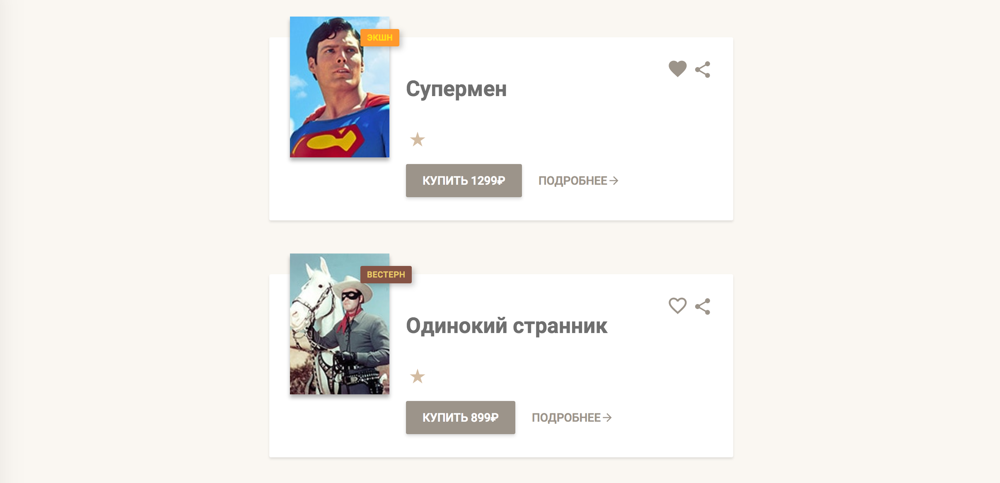

Рейтинг фильмов
===

Необходимо реализовать компонент отображающий рейтинг фильма в виде звезд:



## Описание компонента

Для отображения рейтинга создайте компонент `Stars`, который принимает следующие атрибуты:
- `count` — рейтинг фильтам, _число_, по умолчанию `0`.

Если рейтинг меньше `1` или больше `5`, или вообще не число, то компонент не должен иметь какого-либо представления в DOM.

Звезды рейтинга должны быть представлены тегом `<ul>` с классами `card-body-stars` и `u-clearfix`. Для отображения символа звезды внутри тега `<li>` используйте компонент `Star`.

## Пример использования

```jsx
ReactDOM.render(
  <Stars count={1} />,
  document.getElementById('root')
);
```

Компонент должен дать следующий код:
```html
<ul class="card-body-stars u-clearfix">
  <li>
    <svg fill="#D3BCA2" height="28" viewBox="0 0 18 18" width="28" xmlns="http://www.w3.org/2000/svg">
      <path d="M9 11.3l3.71 2.7-1.42-4.36L15 7h-4.55L9 2.5 7.55 7H3l3.71 2.64L5.29 14z"/>
      <path d="M0 0h18v18H0z" fill="none"/>
    </svg>
  </li>
</ul>
```

## Реализация

Необходимо реализовать компонет `Stars`.

### Локально с использованием git

Компонент необходимо реализовать в файле `./js/Stars.js`. Файл уже подключен к документу, поэтому другие файлы изменять не требуется.

### В песочнице CodePen

Реализуйте компонент во вкладке JS(Babel). Перед началом работы сделайте форк этого пена:

https://codepen.io/Netology/pen/MVxZeV
