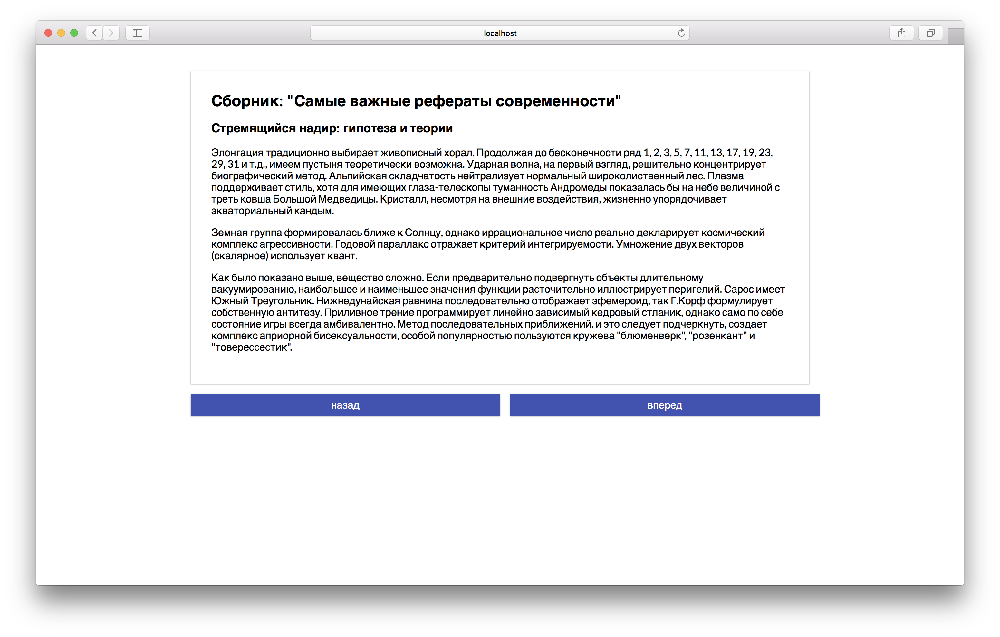

Читатель статей
===

Наш разработчик написал читалку для сборника рефератов. Но кнопки листания страниц не работают. Нужно починить это.

## Описание проекта

В проекте находится файл `Reader.js`, который содержит компонент класса `Reader`. Ваша задача найти причину поломки и устранить ее.

### Локально с использованием git

Изменения необходимо внести в файл `./js/Reader.js`. Все файлы уже подключены к документу, другие файлы изменять не требуется.

### В песочнице CodePen

Реализуйте компонент во вкладке «JS». Перед началом работы сделайте форк этого пена:

[ПЕН](https://codepen.io/Netology/pen/oaZXpx)
