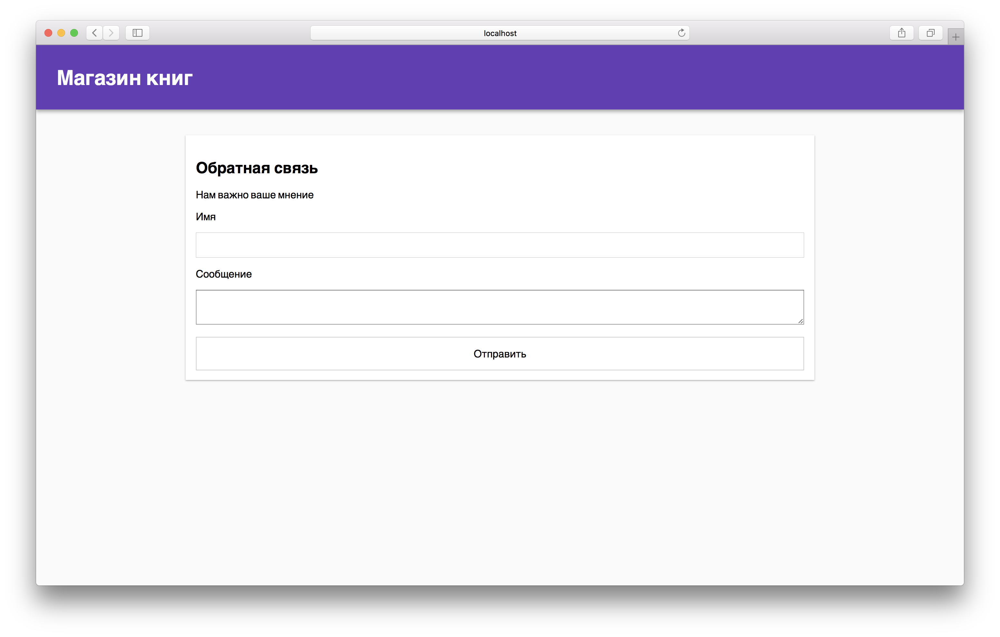

Обратная связь
===

Наша разработчица создала форму для отправки обратной связи. Но после нажатия кнопки "Отправить" ничего не происходит. Необходимо починить форму.

## Описание проекта

В проекте находится файл `Form.js`, содержащий компонент класса `Form`.

Ваша задача доработать компонент формы так, чтобы он выводил в консоль поля формы.

### Локально с использованием git

Изменения необходимо внести в файл `./js/Form.js`. Все файлы уже подключены к документу, другие файлы изменять не требуется.

### В песочнице CodePen

Реализуйте компонент во вкладке «JS». Перед началом работы сделайте форк этого пена:

[ПЕН](https://codepen.io/Netology/pen/KGWper)
