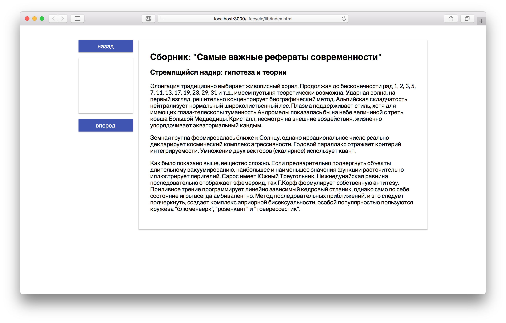
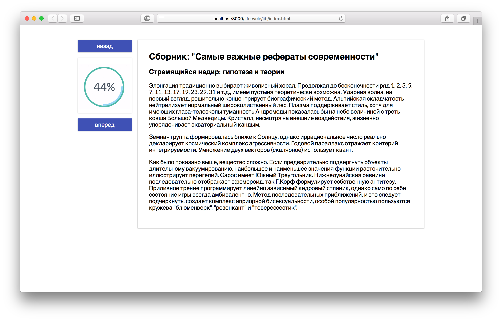

Прогресс-бар на canvas
===

Наш разработчик написал читалку для сборника рефератов. В ней есть возможность отслеживать прогресс чтения. Когда пользователь листает страницы, прогресс бар должен отображать актуальный процент прочитанной части книги.

## Описание проекта

В проекте находится файл `ProgressBar.js`, который содержит компонент класса `ProgressBar`.

Ваша задача:
- рассчитывать процент выполненного при обновлении `props` в `ProgressBar`
- на `canvas` рисовать круговой прогресс бар в соотвествии с расчитанным значением процента выполненного, прогресс бар должен выглядеть как двойное кольцо, внешняя часть которого всегда заполнена (цвет `#4ca89a`), внутренняя заполняется по мере прочтения книги (цвет `#96d6f4`), толщина каждого кольца — 7 пикселей. Радиусы колец – 45 и 52 пикселя соотвественно.

> Пожалуйста, не удаляйте идентификатор `progressCanvas` и класс `progress` у `canvas`.

### Локально с использованием git

Изменения необходимо внести в файл `./js/ProgressBar.js`. Все файлы уже подключены к документу, другие файлы изменять не требуется.

### В песочнице CodePen

Реализуйте компонент во вкладке «JS». Перед началом работы сделайте форк этого пена:

https://codepen.io/Netology/pen/mxKJbr
