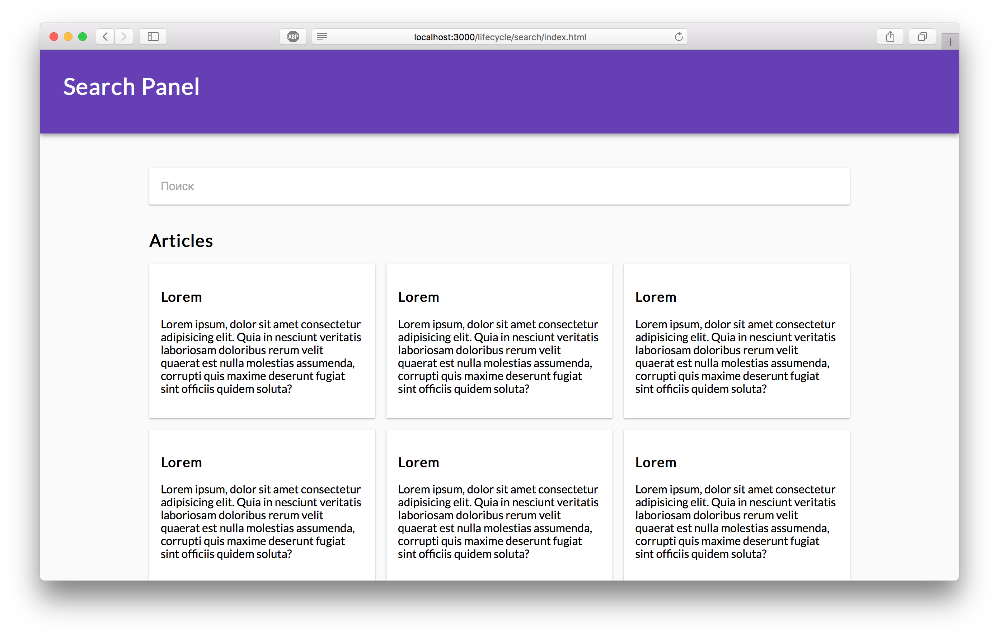
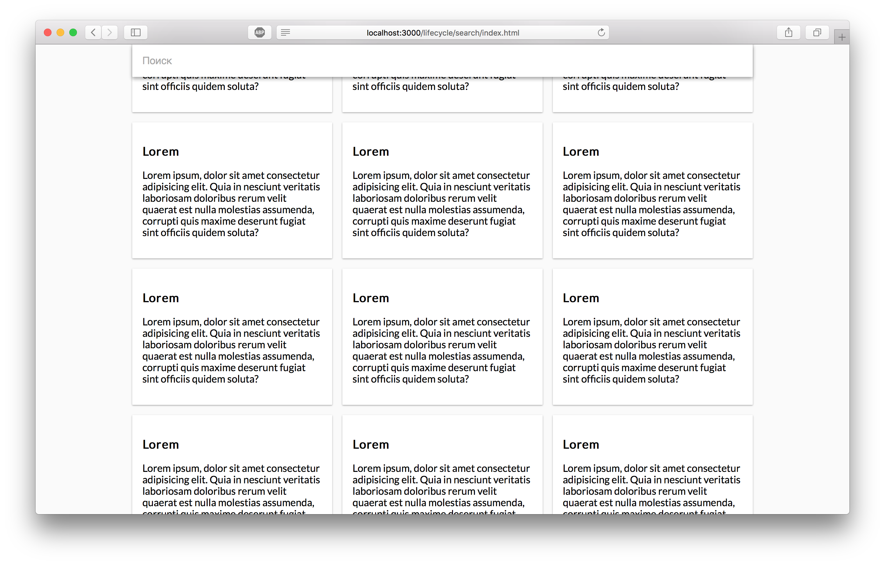

Плавающая поисковая строка
===

Наш разработчик сверстал страницу для просмотра спика статей. На ней есть поисковая строка. Она расположена не в самом верху страницы — под хедером. Когда пользователь скроллит страницу, хедер должен проскролливаться, а поисковая строка — прилипать к верхней границе окна браузера.

## Описание проекта

В проекте находится файл `SearchBox.js`, который содержит компонент класса `SearchBox`.

Ваша задача:
- реализовать функцию `checkOffsetTop` компонента `SearchBox`, чтобы она возвращала расстояние от компонента до верхнего края страницы
setPosition
- реализовать функцию `setPosition` компонента `SearchBox`, чтобы она устанавливала состояние компонента `fixed` взависимости от результата работы функции `checkOffsetTop`
- когда компонент класса `SearchBox` появляется на странице, начинать слушать событие `scroll` и проверять, не пора ли зафиксировать поисковую строку
- когда компонент класса `SearchBox` демонтируется, удалять обработчик события `scroll`, чтобы он не продолжал срабатывать на страницах без поисковой строки

### Локально с использованием git

Изменения необходимо внести в файл `./js/SearchBox.js`. Все файлы уже подключены к документу, другие файлы изменять не требуется.

### В песочнице CodePen

Реализуйте компонент во вкладке «JS». Перед началом работы сделайте форк этого пена:

link
