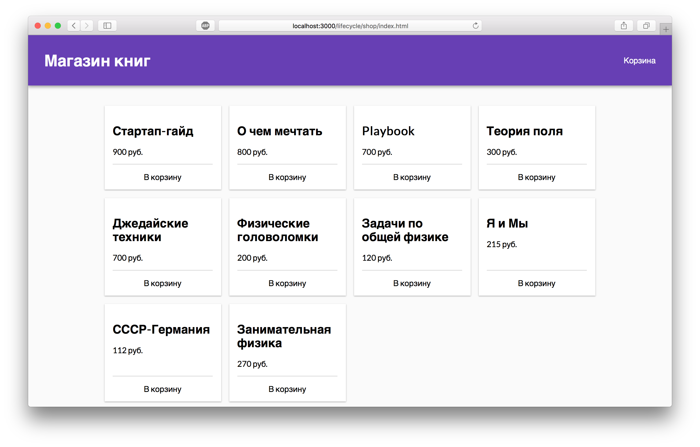

Корзина
===

Наша команда работает сейчас над созданием сайта интернет-магазина. В нем есть корзина товаров. Она полностью реализована, но при тестировании нашли один недостаток, который вам необходимо исправить. Даже когда корзина скрыта, её DOM дерево всё равно обновляется. И это можно назвать бесполезным расходованием ресурсов.

## Описание проекта

В проекте находится файл `Cart.js`, содержащий компонент класса `Cart`, который принимает в `props` следующие свойства:
- `isOpen` — состояние корзины открыта / закрыта, логический тип
- `items` — список товаров в корзине, массив

Ваша задача доработать компонент корзины так, чтобы его DOM дерево обновлялось только когда меняется свойство `isOpen` или корзина открыта и меняется `items.length`

### Локально с использованием git

Изменения необходимо внести в файл `./js/Cart.js`. Все файлы уже подключены к документу, другие файлы изменять не требуется.

### В песочнице CodePen

Реализуйте компонент во вкладке «JS». Перед началом работы сделайте форк этого пена:

https://codepen.io/Netology/pen/BrVNNd
