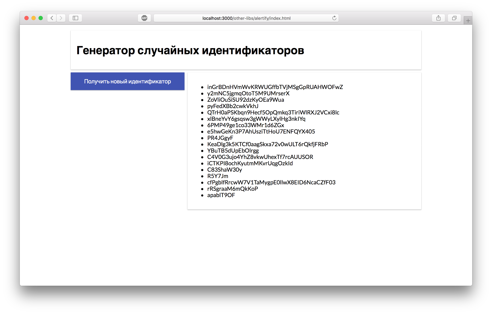
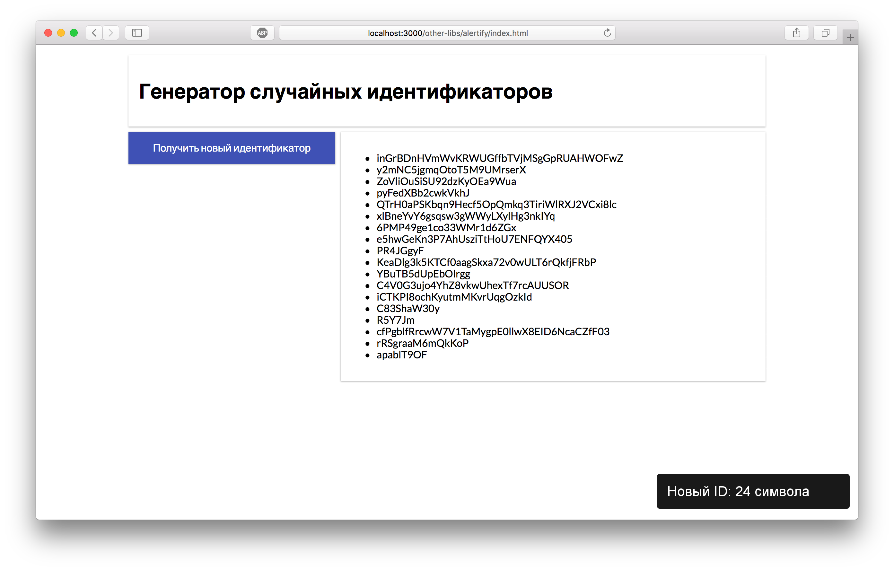

Уведомления и jQuery-плагин
===

Наш разработчик создал приложение для генерации случайных идентификаторов. Необходимо добавить уведомление с информацией о сгенерированном идентификаторе. Уведомление должно пропадать через 10 секунд или после клика на него. Для вывода уведомлений следует использовать бибилиотеку [Alertify](http://fabien-d.github.io/alertify.js/).

## Описание проекта

В проекте находится файл `Alert.js`, который содержит компонент класса `Alert`.

Ваша задача:
- выводить уведомление каждый раз, когда в компоненте `Generator` вызывается метод `generate`
- внутри уведомления показывать длину сгенерированного идентификатора

### Локально с использованием git

Изменения необходимо внести в файлы `./js/Alert.js` и `./js/Generator.js`. Все файлы уже подключены к документу, другие файлы изменять не требуется.

### В песочнице CodePen

Реализуйте компонент во вкладке «JS». Перед началом работы сделайте форк этого пена:

[ссылка на пен](https://codepen.io/Netology/pen/YjMZdp)
