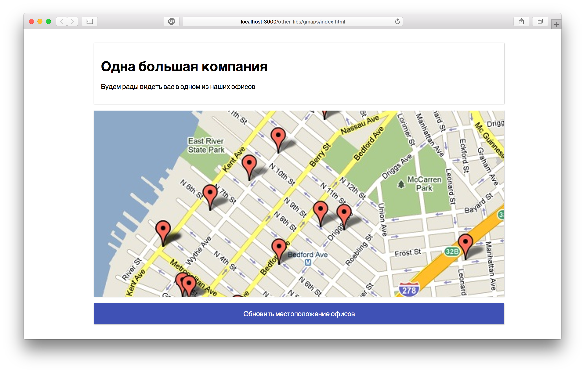

Интеграция Google Maps
===

Наша разработчица создала сайт для одной крупной компании. Сейчас необходимо добавить на этот сайт интерактивную карту, на которой должны быть отмечены офисы компании. Заказчик хочет, чтобы отображалась Google-карта.

## Описание проекта

В проекте находится файл `Map.js`, который содержит компонент класса `Map`. Сейчас этот компонент выводит точки простым текстом.

Ваша задача:
- выводить в компоненте карту, отображающую точки полученные через `props`
- обновлять точки при обновлении `props`

### Локально с использованием git

Изменения необходимо внести в файл `./js/Map.js`. Все файлы уже подключены к документу, другие файлы изменять не требуется.

### В песочнице CodePen

Реализуйте компонент во вкладке «JS». Перед началом работы сделайте форк этого пена:

[ссылка на пен](https://codepen.io/Netology/pen/gjymQx)

### Настройки Google Maps

Используйте инструкцию для настройки интеграции с Google Maps API и получения ключа: [https://developers.google.com/maps/documentation/javascript/get-api-key](https://developers.google.com/maps/documentation/javascript/get-api-key)

Для получения ключа нужно кликнуть на кнопку Get Started > авторизоваться с помощью Google-аккаунта > следовать инструкциям. Потребуется также ввести данные банковской карты. Это стандартное условие получения бесплатного триального доступа на 12 месяцев. [Оплата списываться не будет](https://yadi.sk/i/0Td4H3OWaIctlA). В будущем в работе над разными проектами вам часто потребуется регистрироваться в различных сервисах, поэтому не стоит пугаться =).

Аналогичный пример по настройке Яндекс.Карты мы рассматривали в лекции.
