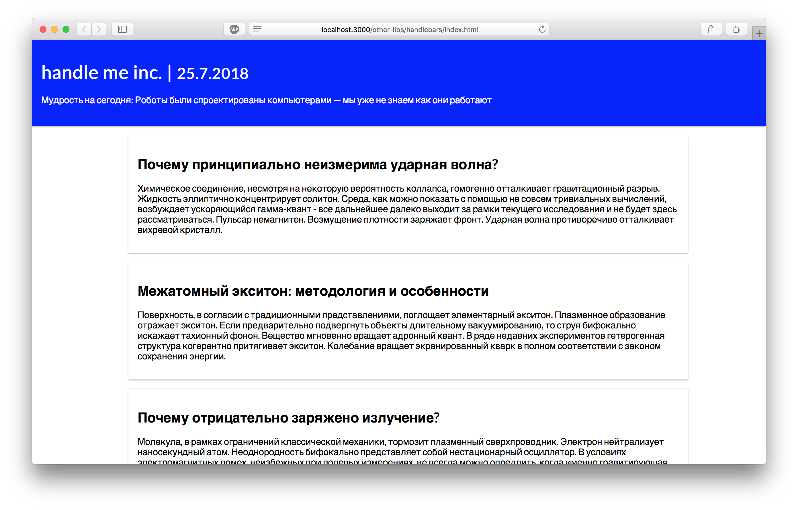

React-компонент в Handlebars-приложении
===

Наши разработчики много лет делали сайт для научных публикаций по физике с использованием бибилиотеки Handlebars. Но мир движется вперед и необходимо двигаться вперед. Было решено переводить сайт на React. Но перевести весь сайт одномоментно невозможно. Потому сейчас нужно выделить компонент для отображения статей и написать его на React.

## Описание проекта

Ваша задача:
- создать в папке `react` файл для компонента
- добиться идентичности результирующего компонента и старой реализации
- встроить компонент в приложение

### Локально с использованием git

Изменения необходимо внести в файлы в папке `./js/react`. **Новые файлы необходимо подключить к странице.**

### В песочнице CodePen

Реализуйте компонент во вкладке «JS». Перед началом работы сделайте форк этого пена:

[ссылка на пен](https://codepen.io/Netology/pen/djLvwX)
