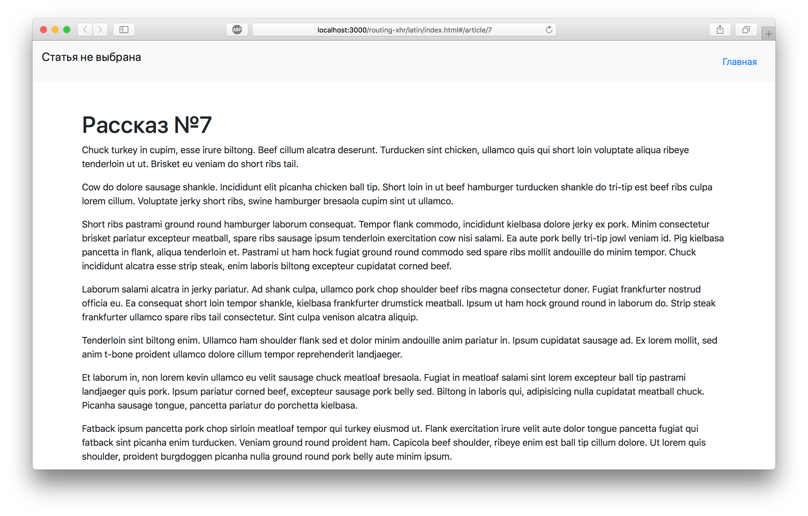

Латинские рассказы
===

Наша разработчица написала приложение для чтения рассказов на латыни. Но по какой-то причине, ничего не работает. Необходимо починить приложение.

## Описание проекта

По задумке автора в верхней части приложения всегда должен выводиться идентификатор читаемого рассказа, который отображается также в адресной строке.

В проекте находится файл проекта `Header.js`. Файл уже подключен к документу, поэтому другие файлы изменять не требуется.

Ваша задача:
- найти причину поломки,
- исправить поломку.

### Локально с использованием git

Изменения необходимо внести в файлы проекта.

### В песочнице CodePen

Реализуйте компонент во вкладке «JS». Перед началом работы сделайте форк этого пена:

[ссылка на пен](https://codepen.io/Netology/pen/QBZYZO)
