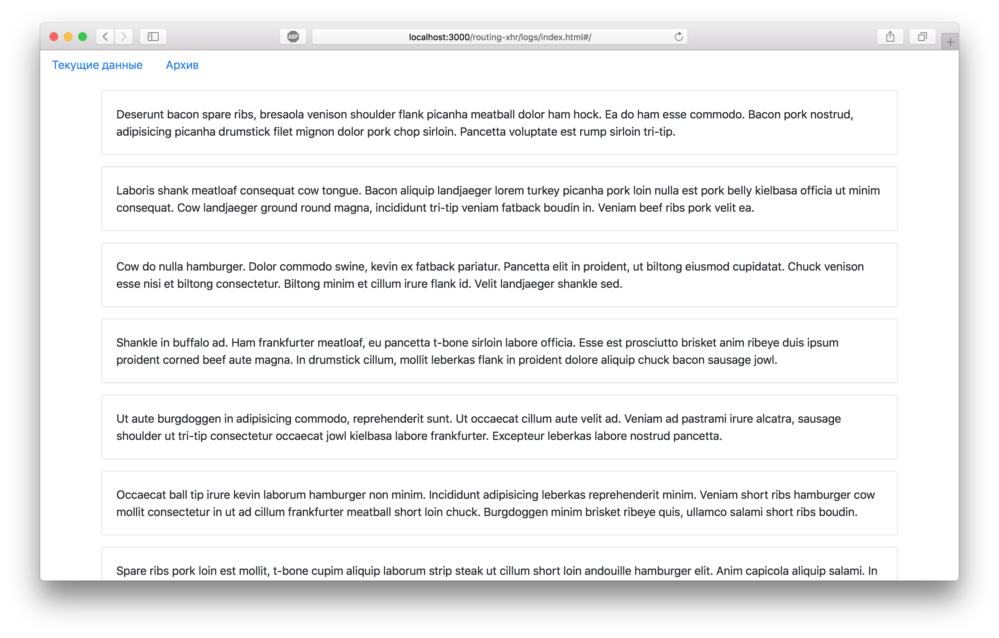

Лог-дисплей
===

Наш разработчик написал удобный интерфейс для просмотра логов с удаленного сервера. Но, как оказалось, код оставляет желать лучшего. Необходимо разделить логику получения данных и роутинга.

## Описание проекта

В проекте находится файл проекта `App.js`, внутри которого сконцетрирована вся логика. Файл уже подключен к документу, поэтому другие файлы изменять не требуется.

Ваша задача:
- разделить логику получения данных с сервера и роутинга,
- вынести логику в  отдельные компоненты.

### Локально с использованием git

Изменения необходимо внести в файлы проекта.

### В песочнице CodePen

Реализуйте компонент во вкладке «JS». Перед началом работы сделайте форк этого пена:

[ссылка на пен](https://codepen.io/Netology/pen/pZxGOL)
