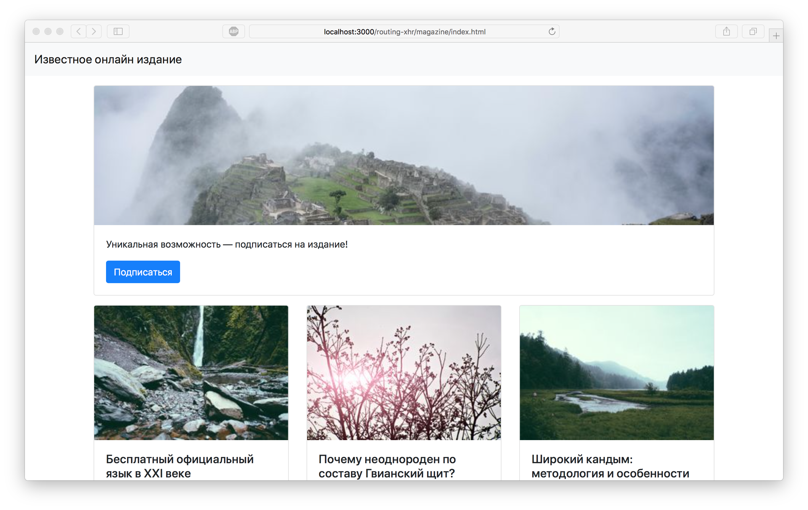

Онлайн-журнал
===

Наши разработчики несколько лет назад сделали сайт для одного известного онлайн-издания. Но переходы между страницами были реализованы топорно, простыми ссылками. Сейчас необходимо это исправить.

## Описание проекта

В проекте неходятся файлы проекта.

Ваша задача:
- определить, в какие компоненты необходимо внести изменения;
- интегрировать в эти компоненты React-Router;
- внутри приложения должны корректно работать кнопки браузера "вперед" и "назад";
- при уходе со страницы "Подписка на издание" необходимо запрашивать у пользователя, уверен ли он, что готов уйти со страницы.

### Локально с использованием git

Изменения необходимо внести в файлы проекта.

### В песочнице CodePen

Реализуйте компонент во вкладке «JS». Перед началом работы сделайте форк этого пена:

[ссылка на пен](https://codepen.io/Netology/project/editor/AbpVEo)
