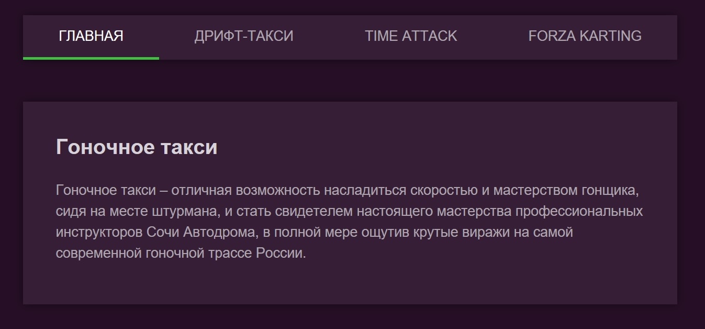

Навигационное меню
===

Необходимо реализовать меню для сайта гоночного такси с пунктами «Главная», «Дрифт-такси», «Time Attack» и «Forza Karting». При переходе на страницу соответствующий пункт меню должен подсветиться:  



## Описание компонента

Компонент должен создавать HTML-разметку вида:
```html
<nav class="menu">
  <a class="menu__item" href="#/">Главная</a>
  <a class="menu__item" href="#/drift">Дрифт-такси</a>
  <a class="menu__item" href="#/timeattack">Time Attack</a>
  <a class="menu__item" href="#/forza">Forza Karting</a>
</nav>
```
Активный пункт меню помечается классом `menu__item-active`.

## Реализация

Необходимо реализовать компонет `Menu`.

### Локально с использованием git

Компонент необходимо реализовать в файле `./js/Menu.js`. Файл уже подключен к документу, поэтому другие файлы изменять не требуется.

### В песочнице CodePen

Реализуйте компонент во вкладке JS(Babel). Перед началом работы сделайте форк этого пена:

https://codepen.io/Netology/pen/ZRrvax
