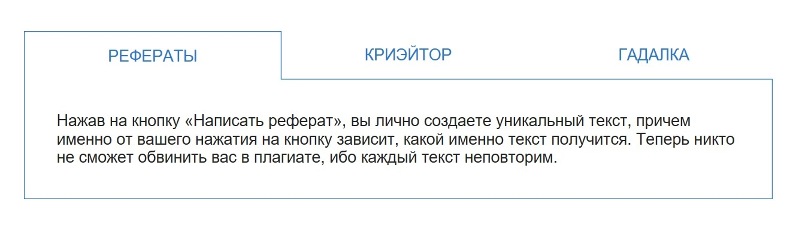

Вкладки
===

Требуется реализовать механизм вкладок, где текущее местоположение пользователя будет сохранено в адресе страницы. При обновлении страницы должна открываться вкладка, указанная в URL. Контент вкладок, список вкладок и их адреса статичные. Контент вкладок реализован компонентами `Essay`, `Creator`, `Fortune`.
При выборе вкладки должен открываться контент этой вкладки, а сама метка вкладки выделяется другим стилем.



## Описание компонента

Компонент должен создавать HTML-разметку вида:
```html
<div class="tabs">
  <nav class="tabs__items">
    <a class="tabs__item" href="#/">Рефераты</a>
    <a class="tabs__item" href="#/creator">Криэйтор</a>
    <a class="tabs__item" href="#/fortune">Гадалка</a>
  </nav>
  <div class="tabs__content">
    ...
  </div>
</div>
```
Активная вкладка помечается классом `tabs__item-active`.

## Реализация

Необходимо реализовать компонет `App`.

### Локально с использованием git

Компонент необходимо реализовать в файле `./js/App.js`. Файл уже подключен к документу, поэтому другие файлы изменять не требуется.

### В песочнице CodePen

Реализуйте компонент во вкладке JS(Babel). Перед началом работы сделайте форк этого пена:

https://codepen.io/Netology/pen/rKJpJr
