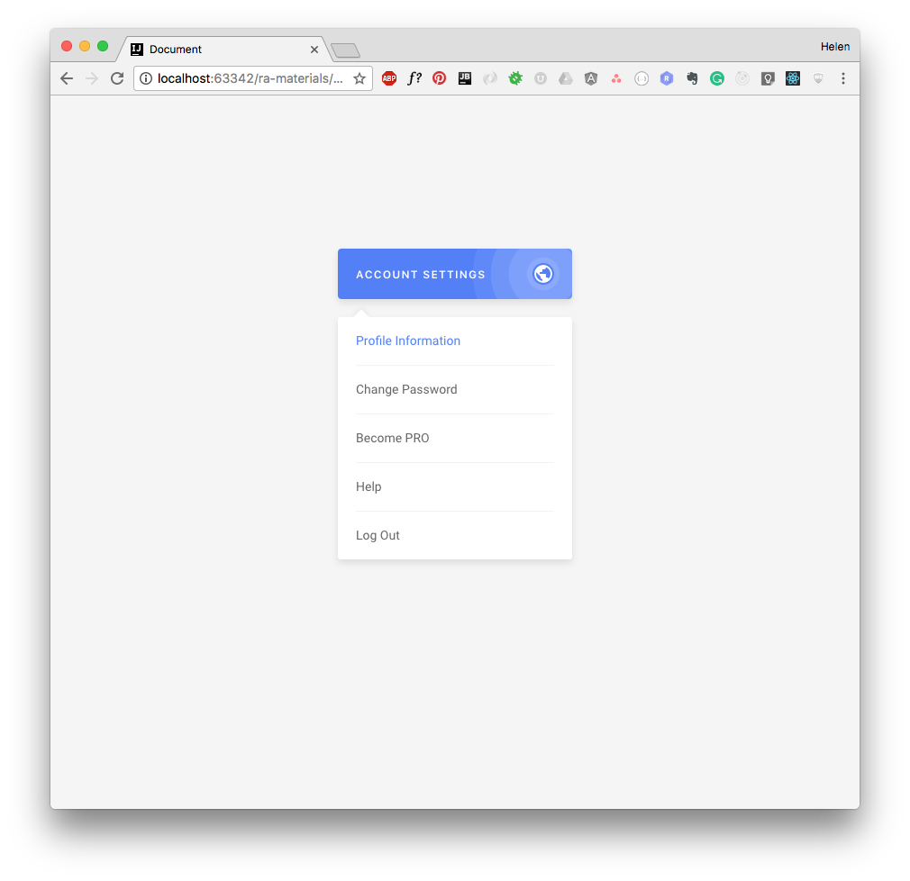

Выпадающий список
===

Наш разработчик нашел в своем старом проекте подходящий для нового проекта компонент выпадающего списка, но он написан с использованием устаревшей функции `React.createClass`, которая в скором времени работать не будет.

## Описание проекта

В проекте находится файл `App.js`, который содержит переменную `App`.

`App` управляет состоянием компонента, в поле `options` он хранит варианты для выбора в виде массива строк. В методе `getInitialState` определено начально состояние:
- `open` — указывает на то, открыт или закрыт выпадающий список,
- `active` — хранит строку с текущим активным вариантом.

Метод `handleChange(option)` — обработчик события, который реагирует на выбор пользователем одного из элементов списка. Обработчик принимает один аргумент — строку с названием варианта и устанавливает его в текущее состояние компонента.

Метод `toggleOpen()` — обработчик события, который реагирует на нажатие пользователем на сам компонент и устанавливает текущее состояние для выпадающего списка (открыт/закрыт).

Ваша задача:
- переписать компонент `App` с использованием классов из ES2015

### Локально с использованием git

Изменения необходимо внести в файл `./js/App.js`. Все файлы уже подключены к документу, другие файлы изменять не требуется.

### В песочнице CodePen

Реализуйте компонент во вкладке «JS». Перед началом работы сделайте форк этого пена:

https://codepen.io/Netology/pen/XEGoeo
