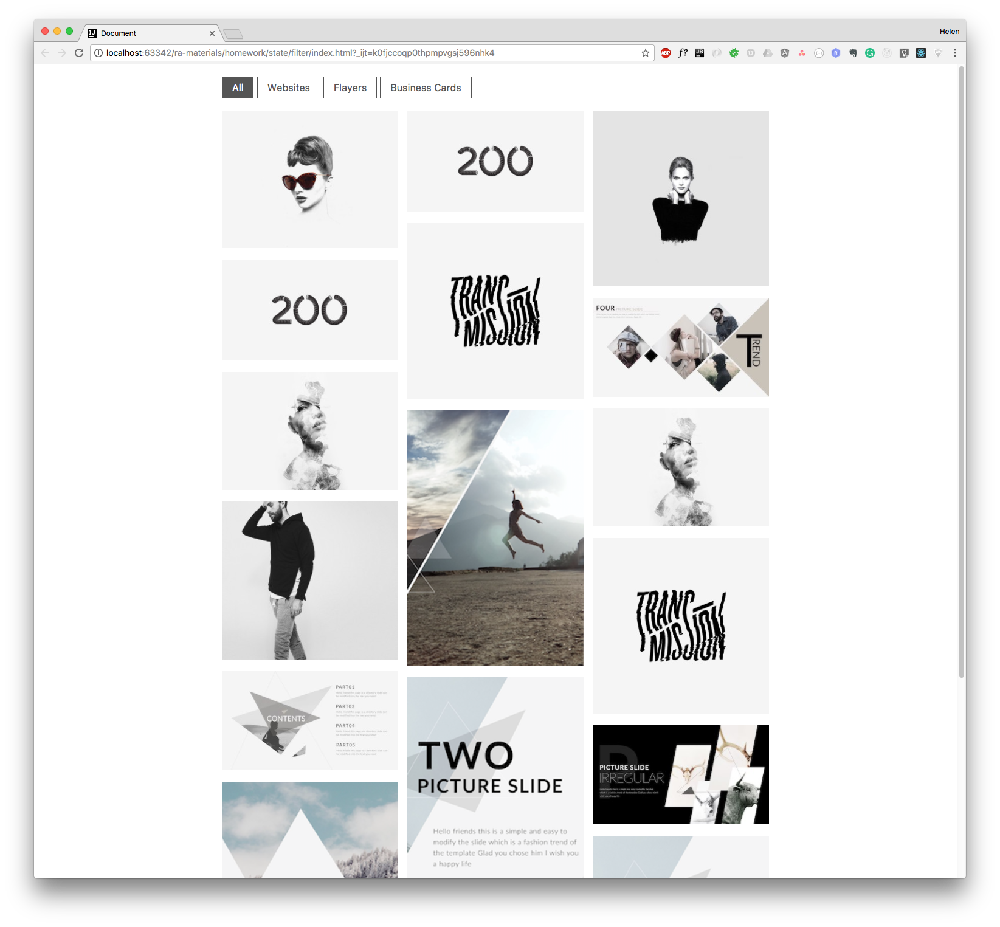
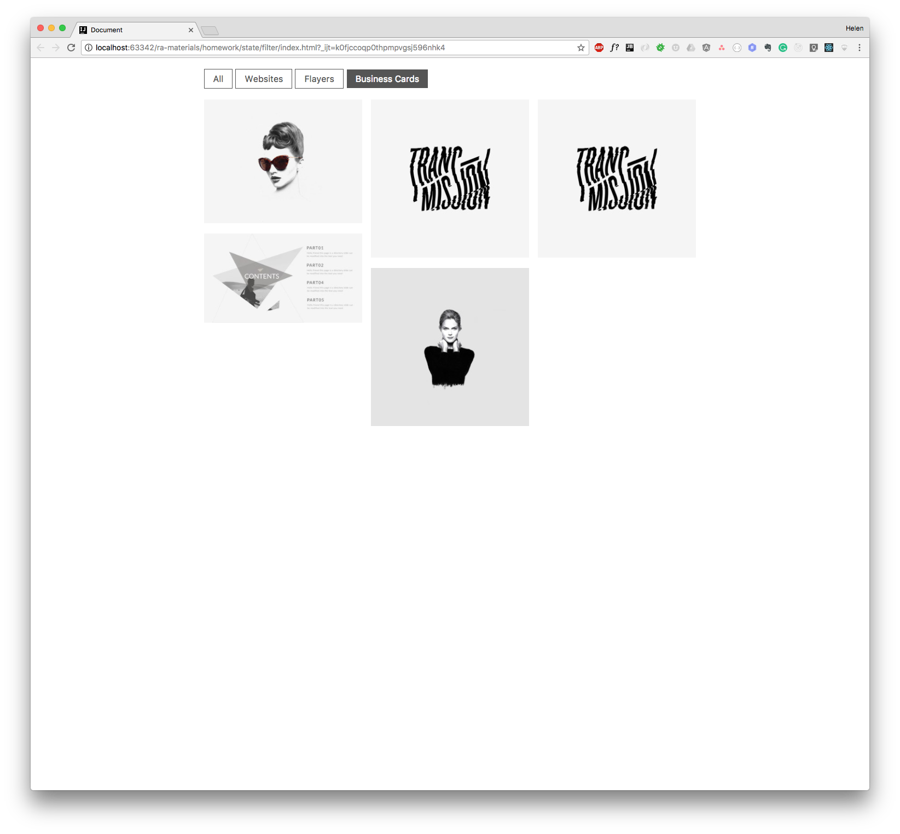

Портфолио с фильтрами
===

Наш разработчик переписал портфолио с фильтрами с чистого DOM API на React. Но фильтры пока не работают. Приложению не хватает состояния.



## Описание проекта

В проекте находится файл `App.js`, который содержит компонент класса `App`.

Компонент класса `App` управляет состоянием приложения, он получает список фильтров через атрибут `filters`, а также список проектов — атрибут `projects`.

Сами фильтры отображаются в компоненте без состояния `Toolbar`, которому от `App` мы передаем три свойства:
- `filters` - список фильтров, название которых совпадает с категориями проектов,
- `selected` - активный фильтр,
- `onSelectFilter(filter)` - обработчик события, который реагирует на выбор пользователем одного из фильтров, обработчик принимает один аргумент — строку с названием фильтра.

Пример:
```
<Toolbar
  filters={["All", "Websites", "Flayers", "Business Cards"]}
  selected="All"
  onSelectFilter={(filter) => {console.log(filter);}}/>
```

В данном примере при выборе фильтра его название будет выведено в консоль. Например «Business Cards».

Изображения самих проектов отображаются компонентом без состояния `Portfolio`, которому от `App` мы передаем список проектов — в свойство `projects`. Отображение проектов — это единственная ответственность компонента `Portfolio`.

Чтобы компонент `App` мог реагировать на выбор пользователем фильтра проектов, например `Business Cards`, и передававать отфильтрованные соответственно по категории `Business Cards` проекты в компонент `Portfolio`, в класс `App` необходимо добавить состояние (state).

Ваша задача:
- установить состояние выбранного фильтра в обработчике события который `App` передает в свойство `onSelectFilter` компонента `Toolbar`
- из компонента `App` передать активный фильтр в свойство `selected` компонента `Toolbar`
- в компоненте `App` отфильтровать по активному фильтру проекты и передать их в компонент `Portfolio`



### Локально с использованием git

Изменения необходимо внести в файл `./js/App.js`. Все файлы уже подключены к документу, другие файлы изменять не требуется.

### В песочнице CodePen

Реализуйте компонент во вкладке «JS». Перед началом работы сделайте форк этого пена:

https://codepen.io/Netology/pen/MVXWLJ
