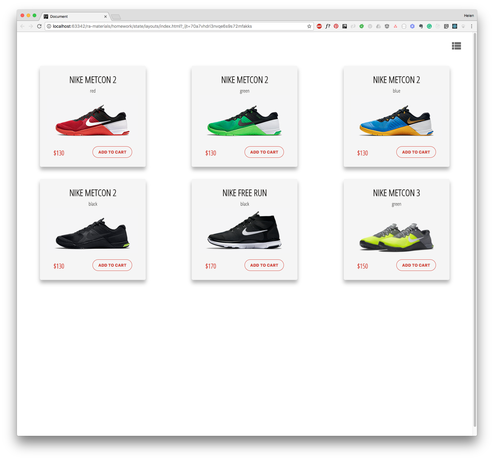
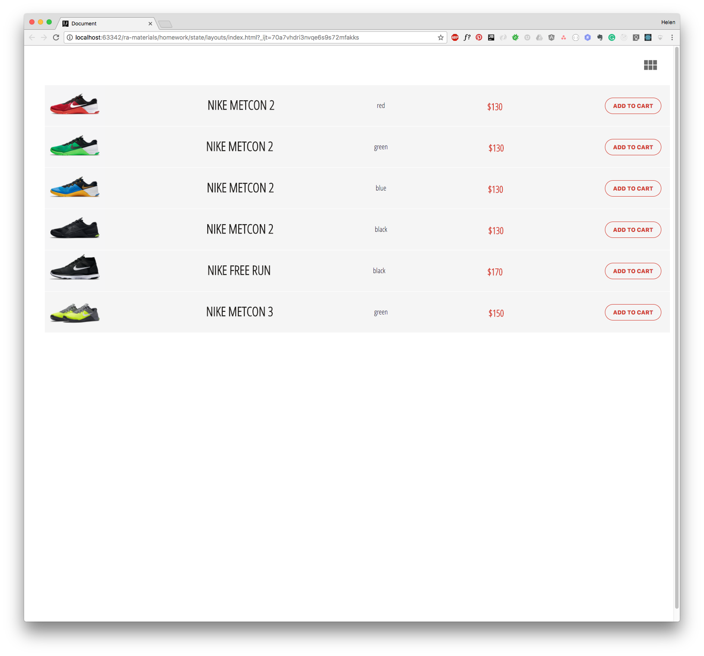

Расположение товаров
===

Наш разработчик делает приложение для отображение товаров в интернет-магазине. Он хочет, чтобы пользователь мог увидеть товары в виде карточек или в виде списка, в зависимости от того, какое расположение выберет пользователь. Однако, разработчик еще не доделал этот функционал. Приложению не хватает состояния.



## Описание проекта

В проекте находится файл `App.js`, который содержит компонент класса `App`.

Компонент класса `App` управляет состоянием приложения, он получает список товаров в атрибуте `products` а так же настройка с адаптивным расположением колонок для экранов с размерами `xs`, `s`, `md`, `lg` в атрибуте `layout`.

Иконка разметки, которая указывает на переключекние между типами расположения товаров реализована в компоненте без состояния `IconSwitch`, которому от `App` мы передаем два свойства:
- `icon` - название иконки, которую хотим показать. Название иконки соответствует названию класса из библиотеки [material icons](https://material.io/icons/#ic_view_module). В нашем случае это - либо `view_list`, либо `view_module`. Эти названия хранятся в константах файла `App.js`.
- `onSwitch()` - обработчик события, который реагирует на нажатие пользователем на иконку.

Пример:
```jsx
<IconSwitch icon={"view_list"} onSwitch={() => console.log("change state here")}/>
```

Сами товары отображаются в компонентах без состояния `CardsView` или `ListView`.

Компоненту `CardsView` от `App` мы передаем два свойства:
- `cards` - массив с карточками товаров `ShopCard`, которые мы хотим отобразить
- `layout` - настройка с адаптивным расположением колонок для экранов с размерами `xs`, `s`, `md`, `lg`.

Компоненту `ListView` от `App` мы передаем всего одно свойство `items` — массив компонентов `ShopItem` для товаров, которые мы хотим отобразить.

Чтобы компонент `App` мог реагировать на выбор пользователем вида разметки, в класс `App` необходимо добавить состояние (state).

Ваша задача:
- установить состояние выбранного типа разметки в обработчике события который `App` передает в свойство `onSwitch` компонента `IconSwitch`
- из компонента `App` передать правильную иконку в свойство `icon` компонента `IconSwitch`
- в компоненте `App` отобразить товары в компоненте `CardsView` или `ListView` соответсвенно состоянию компонента `App`



### Локально с использованием git

Изменения необходимо внести в файл `./js/App.js`. Все файлы уже подключены к документу, другие файлы изменять не требуется.

### В песочнице CodePen

Реализуйте компонент во вкладке «JS». Перед началом работы сделайте форк этого пена:

https://codepen.io/Netology/pen/xWBmPo
