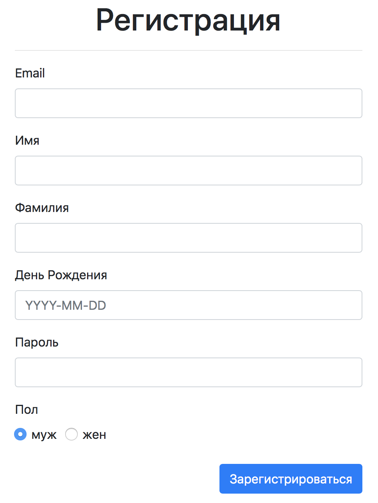

Документация компонентов
===

Имеется набор компонентов, которые облегчают создание 
элементов формы: `TextInput`, `RadioGroup`, `DateInput`.
Используя `PropTypes` задать для существуюших компонентов `TextInput`, `RadioGroup` и 
`DateInput` подходящие правила валидации. `DateInput` должен так 
же иметь `defaultProps`, позволяющий отобразить текущую дату.

## Реализация

Добавить для указанных выше компонентов необходимые propTypes. 

### Локально с использованием git

Компоненты реализованы в файлах `./js/TextInput.js`, `./js/DateInput.js`, `./js/RadioGroup.js`.

### В песочнице CodePen

Измените компоненты во вкладке JS(Babel). Перед началом работы сделайте форк этого пена:

https://codepen.io/Netology/pen/YLqypL
