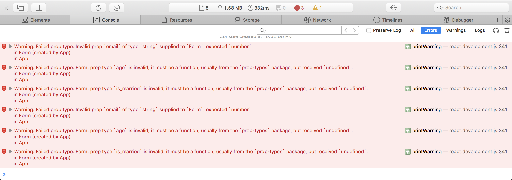
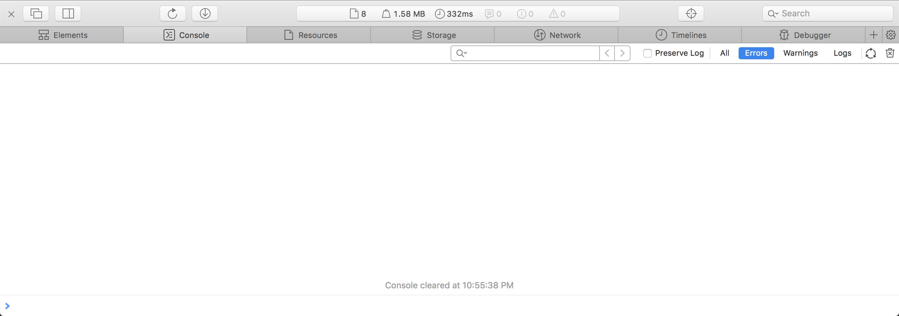

Исправить ошибки программиста
===

Один из программистов подготовил страницу, которая содержит компонент формы `Form` с анкетой и компонент меню `Menu`. К сожалению он плохо разбирался в `PropTypes` и теперь на странице возникают ошибки, как при открытии, так и при заполнении формы.

Консоль браузера с ошибками 

Удалось выяснить, что для компонента `Form` неправильно настроены `PropTypes`, а у компонента `Menu` они настроены верно, но сам компонент используется неправильно, так как данные, которые передаются в `props` компонента, сформированы неправильно.

Ваша задача — внести изменения, которые позволят коду заработать без ошибок. Консоль браузера после исправления ошибок не должна содержать ошибок:

## Реализация

Используя информацию из сообщений об ошибках в консоли браузера внести изменения в существующие правила `Form.propTypes` и `Form.defaultProps` таким образом, чтобы код стал работать корректно. Обратите внимание на то, что поля формы отмеченные звездочкой являются обязательными для заполнения. А так же изменить `props` компонента `Menu`.

### Локально с использованием git

Компонент формы находится в файле `./js/Form.js`, компонент меню в `./js/Menu.js`.

### В песочнице CodePen

Измените компоненты во вкладке JS(Babel). Перед началом работы сделайте форк этого пена:

https://codepen.io/Netology/pen/bMpVgy
