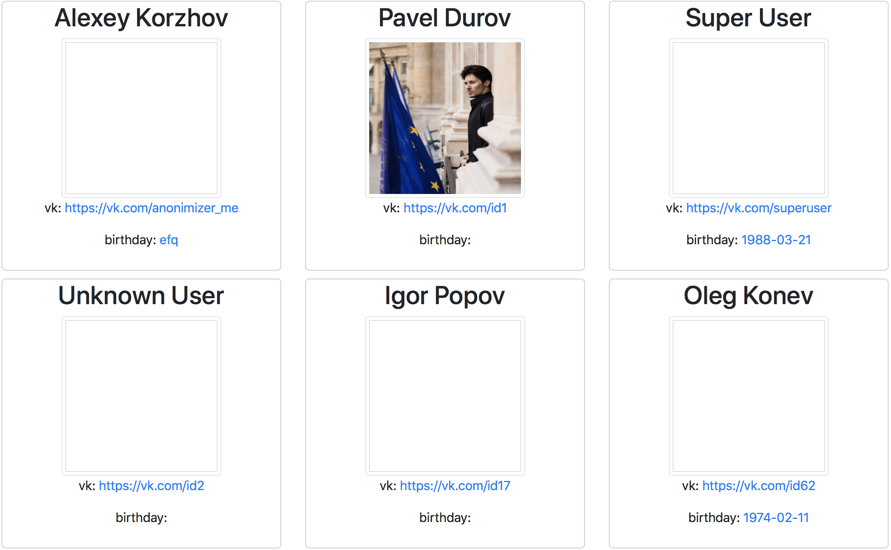

Валидация данных профиля
===

В нашем приложении есть компонент профиля `Profile`, 
который отображает различную информацию о пользователе. 
В данный момент он не имеет `defaultProps` и `propTypes`, 
что зачастую приводит к его неверной работе.

Добавить к компоненту `Profile` необходимые `defaultProps` и 
`propTypes`. Для валидации адреса профиля и даты рождения 
требуется разработать соответствующие валидаторы.

## Реализация

Требуется внести следующие изменения:
- У профиля должна быть картинка по умолчанию (`./images/profile.jpg`).
- Адрес профиля в соц сети должен валидироваться на соответствие url вида `https://vk.com/(id[0-9]+|[A-Za-z0-9_-]+)`.
- Дата рождения должна валидироваться на соответствие формату даты `YYYY-MM-DD` и не быть больше текущей.
- Внести изменения в данные в массиве `profiles` в `state` компонента `App` если требуется.

 

### Локально с использованием git

Компонент профиля `./js/Profile.js`.

### В песочнице CodePen

Измените компонент во вкладке JS(Babel). Перед началом работы сделайте форк этого пена:

https://codepen.io/Netology/pen/WJwQpV
